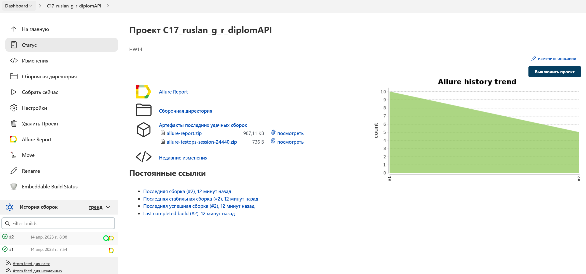
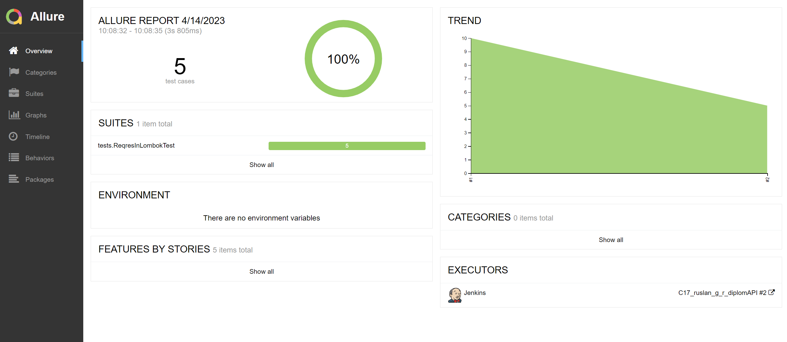
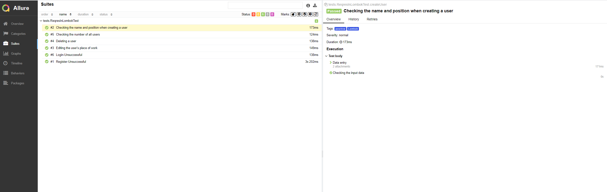
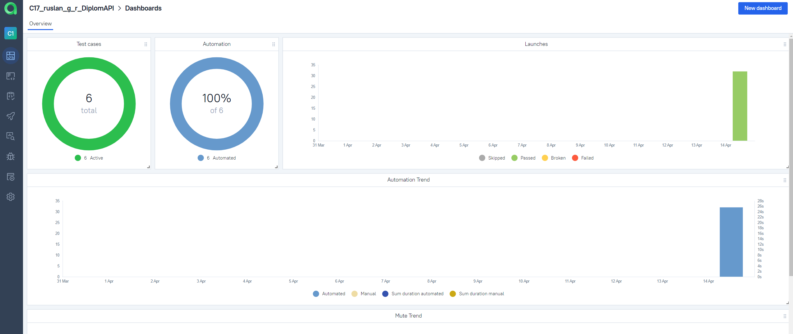
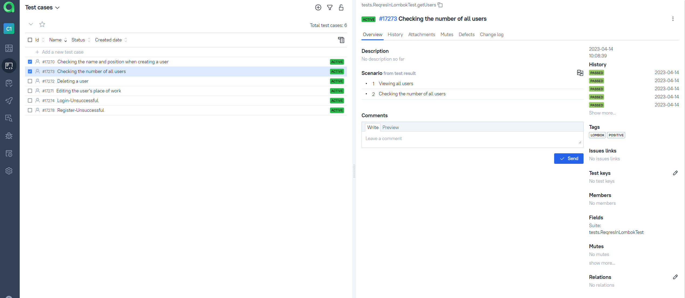
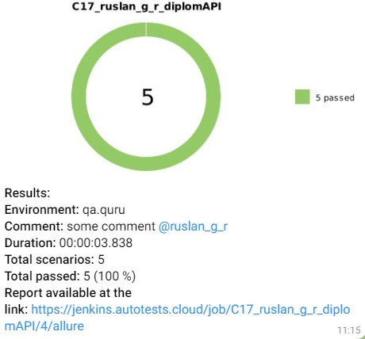

# API Testing Automation Project


## :man_student:: Content:

- [Technology stack](#earth_africa-Стек-технологий)
- [Implemented checks](#earth_africa-Реализованные-проверки)
- [Building in Jenkins](#earth_africa-Jenkins-job)
- [Run from terminal](#earth_africa-Запуск-тестов-из-терминала)
- [Allure report](#earth_africa-Allure-отчет)
- [Integration Allure TestOps](#earth_africa-Интеграция-c-Allure-TestOps)
- [Notification in Telegram](#earth_africa-Уведомление-в-Telegram-при-помощи-бота)

## 🧰: Technology stack

<p align="center">
<a href="https://www.jetbrains.com/idea/"></a>
<a href="https://www.java.com/"></a>
<a href="https://github.com/"></a>
<a href="https://junit.org/junit5/"></a>
<a href="https://gradle.org/"></a>
<a href="https://github.com/allure-framework/allure2"></a>
<a href="https://https://qameta.io/"></a>
<a href="https://www.jenkins.io/"></a>
<a href="https://https://telegram.org/"></a>
</p>

Autotests are written in <code>Java</code> using <code>JUnit 5</code> and <code>Gradle</code>.
For UI tests, the [Selenide] framework (https://selenide.org/) was used.
Tests can be run locally or using [Selenoid](https://aerokube.com/selenoid/).
Also implemented build in <code>Jenkins</code> with generation of an Allure report and sending a notification with the results to <code>Telegram</code> after the run is completed.

Allure report includes:
* test execution steps;
* screenshot of the page in the browser at the end of the autotest;
* Page Source;
* browser console logs;
* video of the autotest.

## :male_detective:: Implemented checks

- ✓ POST/api/users - creating a user account
- ✓ GET/api//users?page=2 - getting a list of users
- ✓ POST/api/login - login
- ✓ POST/api/register - registration in the system
- ✓ DELETE/api/users/2 - user account deletion


# :running_woman: Run tests

### Run tests locally
```
gradle clean test 
```

If necessary, you can override the launch options
```
gradle clean
test/positive/negative - all tests/postitve/negative

```

### Run tests on a remote browser
```
clean test
```
You can also override launch options if needed.

```
clean
test/positive/negative - all tests/postitve/negative
```
## :hammer_and_wrench:: Build options in Jenkins:

- remote (remote server address)
- browserSize (browser window size, default 1920x1080)
- browserVersion (browser version, default 100.0)
- browser (browser, chrome by default)


## </a> Build <a target="_blank" href="https://jenkins.autotests.cloud/job/C17_ruslan_g_r_diplomAPI/"> Jenkins </a>
<p align="center">
<a href="https://jenkins.autotests.cloud/job/C17_ruslan_g_r_diplomAPI/"></a>
</p>

##  <a href="https://jenkins.autotests.cloud/job/C17_ruslan_g_r_diplomAPI/13/allure/">Example Allure-report</a>
### Overview

<p align="center">

</p>

### Test result

<p align="center">

</p>

##  Integration  [Allure TestOps](https://qameta.io/)

### Main Dashboard

<p align="center">
  
</p>

### Test case

<p align="center">
  
</p>


###  Telegram notifications using a bot

<p align="center">

</p>


